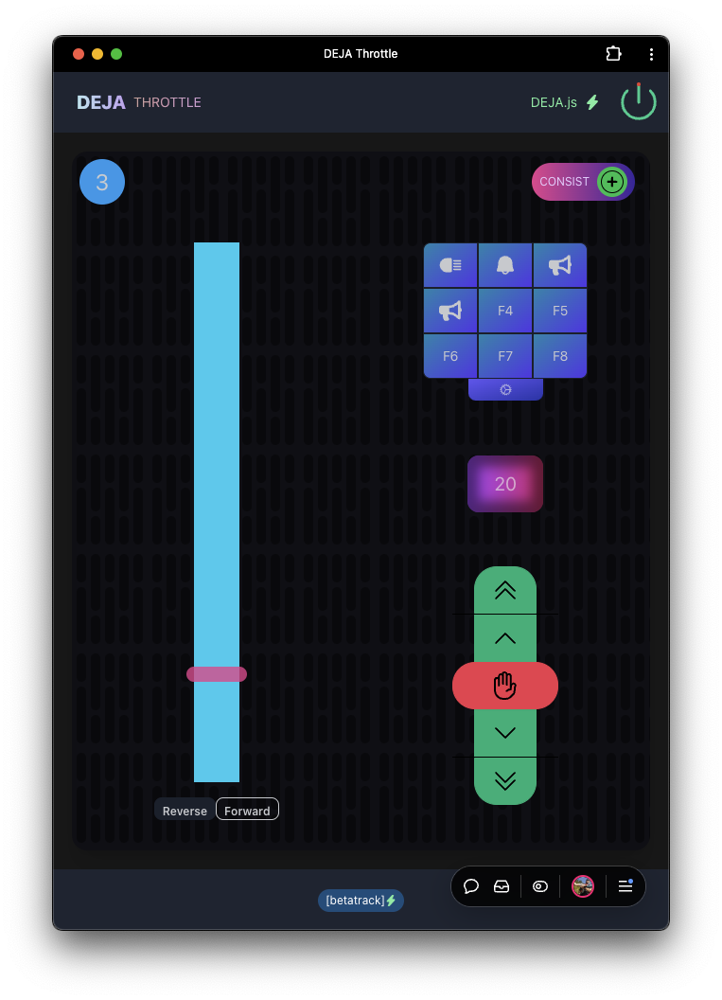
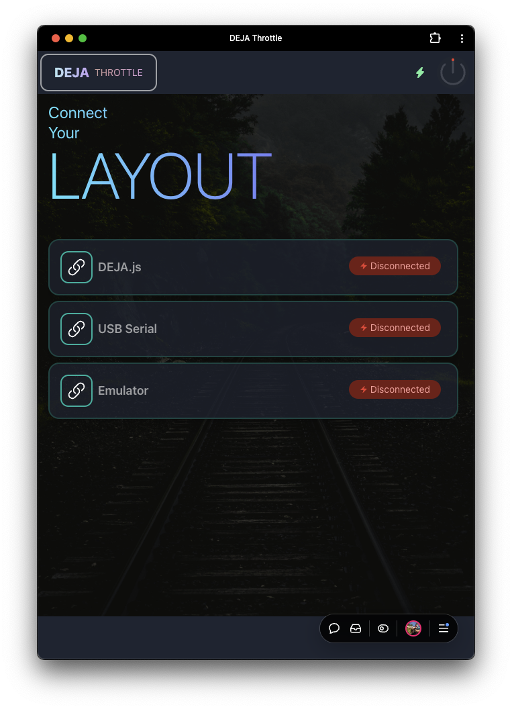
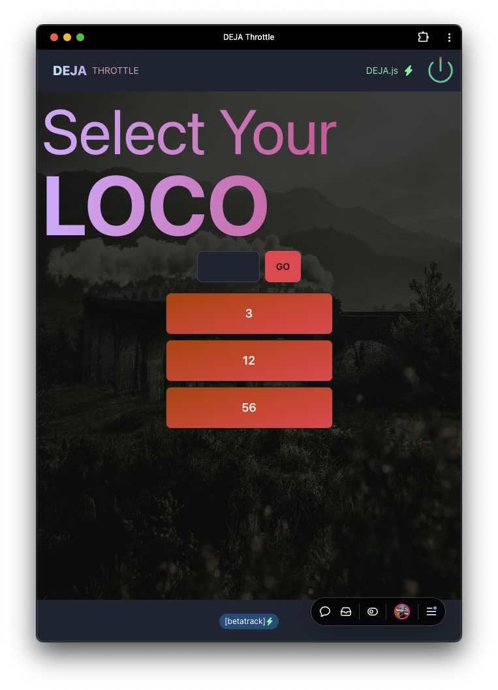
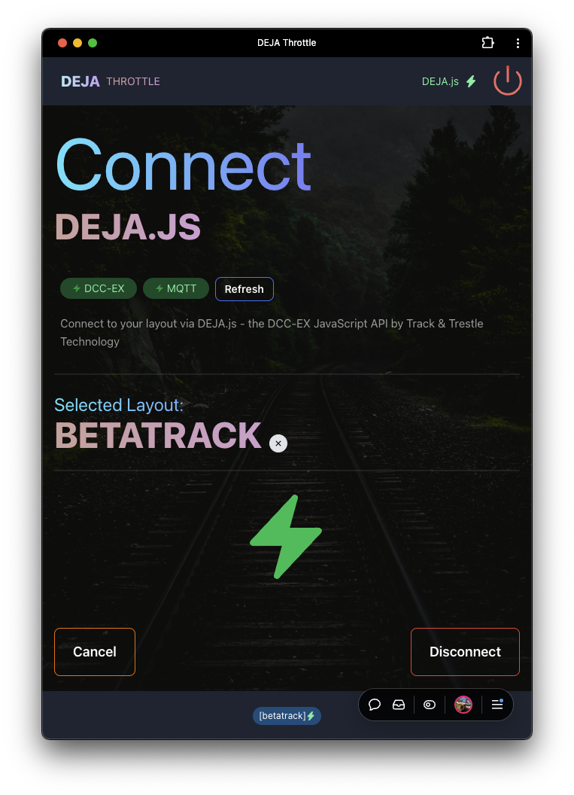

# <span style="color: #16c5d9;">DEJA</span> Throttle

> Current Release: **v0.1.0-alpha**

Vue.js 3 Web App to control DCC locomotives with [🛰️ DEJA.js](https://github.com/jmcdannel/DEJA.js) and [DCC-EX EX-CommandStation](https://dcc-ex.com/ex-commandstation/index.html).

<p align="center">
  
  
  
  
</p>

🚀 [Open DEJA Throttle](https://deja-throttle.vercel.app/) Take 'er for a spin 🚗. Open in Chrome on a computer 💻 with a USB DCC-EX CommandStation, run trains 🚂! Or, try emulator mode to see how easy it is. Better yet, go big-brain 🧠, dive in and install [🛰️ DEJA.js](https://github.com/jmcdannel/DEJA.js) SERVER on a PC/MAC/Linux/Pi 💻 connected to a DCC-EX CommandStation and unleash all the potential of the [DEJA Cloud](https://github.com/jmcdannel/DEJA.js) and instant wireless throttle control📲 on any modern device with a browser.

- 🤯 Emulator Mode Available
- 🧠 Install as an app? Click YES for premium experience
- 💄 Beatiful UI, Dark Mode FTW
- 🔥 Blazing fast on Vercel, frequent deployments, PRs welcome
- 🟪 Chonky A$$ Buttons for fat fingers and panic stops

## 🚀 Getting Started

### 📦 Prerequisites

There are 3 ways to use DEJA Throttle.

1. [🛰️ DEJA.js](https://github.com/jmcdannel/DEJA.js) (✨preferred✨)
  - Install and configure [🛰️ DEJA.js](https://github.com/jmcdannel/DEJA.js) on a 💻 PC/Mac/Linux/Pi connected via USB to a [DCC-EX EX-CommandStation](https://dcc-ex.com/ex-commandstation/index.html) 
  - Open [DEJA Throttle](https://deja-throttle.vercel.app/) - in any modern browser 🔥.
  - Select "DEJA.js" from the connection menu
  - Enter the layout name you used in the `.env` (Environment Variable) [ LAYOUT_ID ] when installing DEJA.js
  - Select the USB Port the DCC-EX Command Station is connected to.
  - 🎯 Drive Trains, 👑 Rule over your tiny world!

2. Direct USB Connection (🔗limited🔗)

  - Requires Chrome web browser.
  - Browser must be on 💻 PC/Mac/Linux/Pi connected via USB to a [DCC-EX EX-CommandStation](https://dcc-ex.com/ex-commandstation/index.html) - you can't open this on your phone or tablet and walk around a layout room. But you can with ✨[🛰️ DEJA.js](https://github.com/jmcdannel/DEJA.js)✨!
  - Open [DEJA Throttle](https://deja-throttle.vercel.app/)
  - Select "USB Serial" from the connection menu
  - Click "Connect" and select the USB port connected to your DCC-EX CommandStation.
  - 🎯 Drive Trains!

3. Emulator (💄demo the app💄)
 - Open [DEJA Throttle](https://deja-throttle.vercel.app/)
 - Select "Emulator" from the connection menu. 
 - Click "Connect" and enter any DCC Address to see how the throttle works and operates. 
 - 🎯 (pretend to) Drive Trains!
 - No communication is actually sent to a DCC-EX CommandStation.


### 📦 Local Installation
Want to run this on your own? Fork it, clone it, PR it. Just don't sell it.
```sh
pnpm install
pnpm run start
```

## 🧩 Usage

🚀 [Open DEJA Throttle](https://deja-throttle.vercel.app/) Take 'er for a spin. Docs someday...

## 🗺️ Roadmap

- Connect DEJA Cloud
- Enable Turnouts, Outputs (Effects)
- Enable multiple throttles
- Read throttle state from DCC-EX
- Light/Dark/Custom themes
- much, much more...

## 🛠️ Built With


[![Vue][Vue.js]][Vue-url]
[![TypeScript][TypeScript]][TypeScript-url]
[![Tailwind][Tailwind.css]][Tailwind-url]
[![DaisyUI][DaisyUI]][DaisyUI-url]
[![MQTT][MQTT.js]][MQTT-url]
[![Vite][Vite]][Vite-url]
[![pnpm][pnpm]][pnpm-url]
[![ESLint][ESLint]][ESLint-url]
[![Prettier][Prettier]][Prettier-url]
[![Autoprefixer][Autoprefixer]][Autoprefixer-url]


<!-- MARKDOWN LINKS & IMAGES -->
<!-- https://www.markdownguide.org/basic-syntax/#reference-style-links -->
[contributors-shield]: https://img.shields.io/github/contributors/github_username/repo_name.svg?style=for-the-badge
[contributors-url]: https://github.com/github_username/repo_name/graphs/contributors
[forks-shield]: https://img.shields.io/github/forks/github_username/repo_name.svg?style=for-the-badge
[forks-url]: https://github.com/github_username/repo_name/network/members
[stars-shield]: https://img.shields.io/github/stars/github_username/repo_name.svg?style=for-the-badge
[stars-url]: https://github.com/github_username/repo_name/stargazers
[issues-shield]: https://img.shields.io/github/issues/github_username/repo_name.svg?style=for-the-badge
[issues-url]: https://github.com/github_username/repo_name/issues
[license-shield]: https://img.shields.io/github/license/github_username/repo_name.svg?style=for-the-badge
[license-url]: https://github.com/github_username/repo_name/blob/master/LICENSE.txt
[linkedin-shield]: https://img.shields.io/badge/-LinkedIn-black.svg?style=for-the-badge&logo=linkedin&colorB=555
[linkedin-url]: https://linkedin.com/in/linkedin_username
[product-screenshot]: images/screenshot.png
[Vue.js]: https://img.shields.io/badge/Vue.js-35495E?style=for-the-badge&logo=vuedotjs&logoColor=4FC08D
[Vue-url]: https://vuejs.org/
[Tailwind.css]: https://img.shields.io/badge/Tailwind-06B6D4?style=for-the-badge&logo=tailwindcss&logoColor=white
[Tailwind-url]: https://tailwindcss.com/
[MQTT.js]: https://img.shields.io/badge/MQTT-660066?style=for-the-badge&logo=mqtt&logoColor=white
[MQTT-url]: https://mqtt.org/
[pnpm]: https://img.shields.io/badge/pnpm-F69220?style=for-the-badge&logo=pnpm&logoColor=white
[pnpm-url]: https://pnpm.io/
[TypeScript]: https://img.shields.io/badge/Typescript-3178C6?style=for-the-badge&logo=typescript&logoColor=white
[TypeScript-url]: https://www.typescriptlang.org/
[DaisyUI]: https://img.shields.io/badge/daisyUI-5A0EF8?style=for-the-badge&logo=daisyui&logoColor=white
[DaisyUI-url]: https://daisyui.com/
[ESLint]: https://img.shields.io/badge/ESLint-4B32C3?style=for-the-badge&logo=eslint&logoColor=white
[ESLint-url]: https://eslint.org/
[Prettier]: https://img.shields.io/badge/Prettier-F7B93E?style=for-the-badge&logo=prettier&logoColor=white
[Prettier-url]: https://prettier.io/
[Vite]: https://img.shields.io/badge/Vite-646CFF?style=for-the-badge&logo=vite&logoColor=white
[Vite-url]: https://vitejs.dev/
[Autoprefixer]: https://img.shields.io/badge/Autoprefixer-DD3735?style=for-the-badge&logo=autoprefixer&logoColor=white
[Autoprefixer-url]: https://autoprefixer.github.io/

<!-- 🧠💄🦩🔥✨🎯📲✅🟪📣🚗🚂🚆🗺️ -->